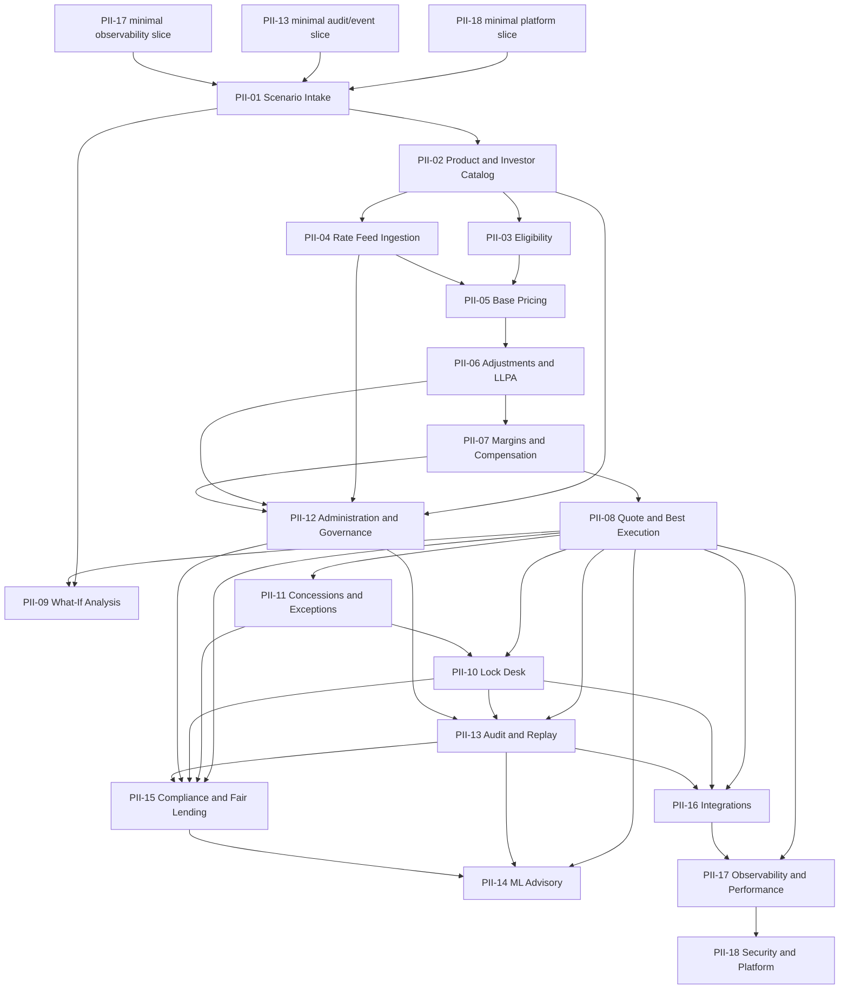

# Implementation DAG

## Milestone Gates
| Gate | Scope | Exit Criteria |
|---|---|---|
| M0 Foundation | Minimal tenant/auth, audit/event, observability | Tenant context, idempotency, event envelope, audit refs, correlation IDs. |
| M1 Scenario Foundation | PII-01 | Durable scenario lifecycle, immutable snapshots, validation, replay. |
| M2 Product Catalog | PII-02 | Versioned products/investors/channels with active lookup. |
| M3 Eligibility Shell | PII-03 | Eligibility decisions and reason codes over scenario/catalog. |
| M4 Active Rate Pricing | PII-04 + PII-05 | Published feeds resolve deterministic base prices. |
| M5 Waterfall Pricing | PII-06 + PII-07 | LLPAs, overlays, fees, margins, comp, explanation ledger. |
| M6 Quote Orchestration | PII-08 | Ranked quote options with replay hash and audit. |
| M7 Downstream Workflow | PII-10 + PII-11 | Locks and concessions with approvals and freshness checks. |
| M8 Governed Operations | PII-12 + PII-13 | Config lifecycle and replayable evidence. |
| M9 Enterprise Controls | PII-15 + PII-16 | Compliance monitoring and integrations. |
| M10 Production Readiness | PII-17 + PII-18 | SLOs, security, tenant isolation proof, runbooks. |
| M11 Advisory Intelligence | PII-14 | Non-authoritative governed ML advisory. |

## Runtime Validation Receipts
- 2026-05-15: PII-01 `scenario-service` deployed to k3s, RBAC fail-closed and replay role validation passed.
- 2026-05-15: PII-02 `catalog-service` deployed to k3s, lifecycle/RBAC smoke passed; publish returned `PUBLISHED` version `9`.
- 2026-05-16: PII-03 `eligibility-service` deployed to k3s, quote endpoint and loan-limit rule endpoint smoke passed; RBAC denied missing role with HTTP `403`.
- 2026-05-17: PII-02 `catalog-service:0.1.4` deployed to k3s, Flyway migrated `catalog` to v3, `/versions` returned a per-artifact version-control row.
- 2026-05-17: PII-03 `eligibility-service:0.1.2` deployed to k3s, Flyway migrated `eligibility` to v2, quote explanation endpoint returned `ELIGIBLE` with two governed rule decisions.
